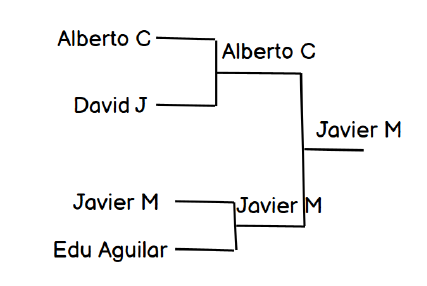

# 👩🏻‍💻 Parte 2: Wimblecode [[solución]](./wimblecode.js) [[solución torneo]](./wimblecode-tournament.js)

Nos acaba de contratar **Wimblecode** para que desarrollemos un software que registre los
partidos y el marcador de cada encuentro. Para poder desarrollar este proyecto, nuestro
cliente y propietario de Wimblecode nos ha proporcionado las reglas de este deporte para
desarrolladores, de manera que podamos tener claro lo que tendremos que crear.

El torneo tiene un **máximo y mínimo de 4 jugadores**: **_“Alberto Casero”, “David Jiménez”,
“Javier de Miguel”, “Eduardo Aguilar”_**.

Estos jugadores juegan un play-off, donde si ganan un partido con su rival avanzan a la
siguiente ronda. Ejemplo de una partida:

[](./ejemplo-partida.png)

## Funcionamiento del torneo y el deporte Wimblecode.

### ¿Como se gana un torneo?

Si un jugador gana un partido, avanza y se enfrenta al siguiente jugador que ganó su partido.
**_En la imagen se puede ver que el ganador del torneo fue Javier M_**.

### ¿Como se gana un partido?

Cada partido tiene juegos, el primero que gane 2 es el ganador del partido.

### ¿Como se gana un juego?

Para ganar un juego, el jugador tiene que cumplir estos requisitos:

- Debe ganar 4 rondas.
- Para que un juego se considere como victoria, debe tener una diferencia de 2
  con respecto al otro jugador cuando llegue a 4. Es decir, si el jugador 1 tiene
  4 rondas ganadas y el jugador 2 tiene 3, el jugador 1 aún no es considerado
  ganador. Tendría que ganar una quinta ronda.
- El máximo de rondas es 7, en caso de un partido muy reñido.

### ¿Como se gana una ronda?

El sistema de puntuación es el siguiente:

- Cada jugador puede tener alguno de estos puntos en un juego: 0, 15, 30, 40.
  Cada vez que un jugador se lleva un punto, la puntuación aumenta en este
  orden: 0 -> 15 -> 30 -> 40 -> Ganas\*.
- Si tienes 40 y ganas la siguiente tirada, ganas la ronda, pero hay reglas
  especiales:
  - Si ambos tienen 40 puntos, los jugadores están en "deuce" (empate).
  - Si el juego está en "deuce", el ganador de un punto obtendrá ventaja y si gana el siguiente punto ganaría la ronda.
  - Si el jugador con ventaja gana la pelota, gana la ronda.
  - Si el jugador sin ventaja gana, vuelven a estar en "deuce".

## Funcionamiento del software a desarrollar

Nuestro cliente, nos dijo como debería de funcionar este software y nos dejo los métodos
que quiere para poder probarlo. Este sería el ejemplo que nos dio:

### Ejemplo de un partido:

```javascript
// Ejemplo de software
const game = createMatch("Alberto C", "David J");
// Cuando puntua el 1º judagor se registra de este modo
game.pointWonBy(1);
// Cuando puntua el 2º judagor se registra de este modo
game.pointWonBy(2);
// Quiero poder ver como va la ronda actual en todo momento
console.log(game.getCurrentRoundScore()); // Alberto C 15-15 David J
game.pointWonBy(1);
console.log(game.getCurrentRoundScore()); // Alberto C 30-15 David J
game.pointWonBy(2);
console.log(game.getCurrentRoundScore()); // Alberto C 30-30 David J
game.pointWonBy(1);
console.log(game.getCurrentRoundScore()); // Alberto C 40-30 David J
game.pointWonBy(2);
console.log(game.getCurrentRoundScore()); // Deuce
// jugador 1 toma ventaja
game.pointWonBy(1);
console.log(game.getCurrentRoundScore()); // Advantage Alberto C
// jugador 2 empata
game.pointWonBy(2);
console.log(game.getCurrentRoundScore()); // Deuce
// jugador 2 toma ventaja
game.pointWonBy(2);
console.log(game.getCurrentRoundScore()); // Advantage David J
// Con este punto jugador 2 gana la ronda
game.pointWonBy(2);
// Quiero poder ver como va la puntuación de un juego
console.log(game.getRoundsScore()); // Alberto C 0 David J 1
// La primera ronda es para David le quedan 3 para ganar un juego
```

Con esto la puntuación queda de la siguiente manera:

| Player  | Games | Rounds |
| ------- | ----- | ------ |
| Alberto | 0     | 0      |
| David   | 0     | 1      |

```javascript
game.pointWonBy(2); // Jugador 2 anota un punto
game.pointWonBy(2); // Jugador 2 anota un punto
game.pointWonBy(2); // Jugador 2 anota un punto
game.pointWonBy(2); // Jugador 2 anota un punto
// David gana 2º ronda
game.pointWonBy(2); // Jugador 2 anota un punto
game.pointWonBy(2); // Jugador 2 anota un punto
game.pointWonBy(2); // Jugador 2 anota un punto
game.pointWonBy(2); // Jugador 2 anota un punto
// David gana 3º ronda
game.pointWonBy(2); // Player 2 wins the game
game.pointWonBy(2); // Player 2 wins the game
game.pointWonBy(2); // Player 2 wins the game
game.pointWonBy(2); // Player 2 wins the game
// David gana 4º ronda
// Primer juego ganado
console.log(game.getMatchScore()); // Alberto C 0 David J 1
```

Con esto la puntuación queda de la siguiente manera 0 juegos para Alberto y 1 juego para
David. 0 rondas para alberto y 0 para david ya que comenzamos un juego nuevo.

| Player  | Games | Rounds |
| ------- | ----- | ------ |
| Alberto | 0     | 0      |
| David   | 1     | 0      |

Si continua ganando David, al final acabará ganando el partido.

```javascript
game.pointWonBy(2); // Jugador 2 anota un punto
game.pointWonBy(2); // Jugador 2 anota un punto
game.pointWonBy(2); // Jugador 2 anota un punto
game.pointWonBy(2); // Jugador 2 anota un punto
// gana ronda 1º
game.pointWonBy(2); // Jugador 2 anota un punto
game.pointWonBy(2); // Jugador 2 anota un punto
game.pointWonBy(2); // Jugador 2 anota un punto
game.pointWonBy(2); // Jugador 2 anota un punto
// gana ronda 2º
game.pointWonBy(2); // Jugador 2 anota un punto
game.pointWonBy(2); // Jugador 2 anota un punto
game.pointWonBy(2); // Jugador 2 anota un punto
game.pointWonBy(2); // Jugador 2 anota un punto
// gana ronda 3º
game.pointWonBy(2); // Jugador 2 anota un punto
game.pointWonBy(2); // Jugador 2 anota un punto
game.pointWonBy(2); // Jugador 2 anota un punto
game.pointWonBy(2); // Jugador 2 anota un punto
// gana ronda 4º
// Método para ver los juegos de cada jugador
console.log(game.getMatchScore()); // Alberto C 0\nDavid J 2
// método para ver el ganador. Si aún no hay ganador retornar null
console.log(game.getWinner()); // Output: "David J"
```

| Player  | Games | Rounds |
| ------- | ----- | ------ |
| Alberto | 0     | 0      |
| David   | 2     | 0      |

Con esto David ganaría el partido.

### Para el torneo (opcional)

Nuestro cliente quiere poder ver una simulación de que el software anterior funciona y nos
pide simular un torneo antes de el usar los métodos anteriormente descritos.

Tenemos que crear una función que cree nuestro play-off de la captura anterior y que simule
los partidos de forma aleatoria, hasta generar un ganador por partido y seguir avanzando en
el torneo hasta el ganador final.

Como es una simulación y podemos añadir puntos a los jugadores de forma aleatoria. Para
ello podemos usar

```javascript
const randomPoint = Math.floor(Math.random() * 2) + 1;
```

Para obtener un valor random entre 1 y 2.

Para simular el torneo, recomiendo usar bucles, for y while.
